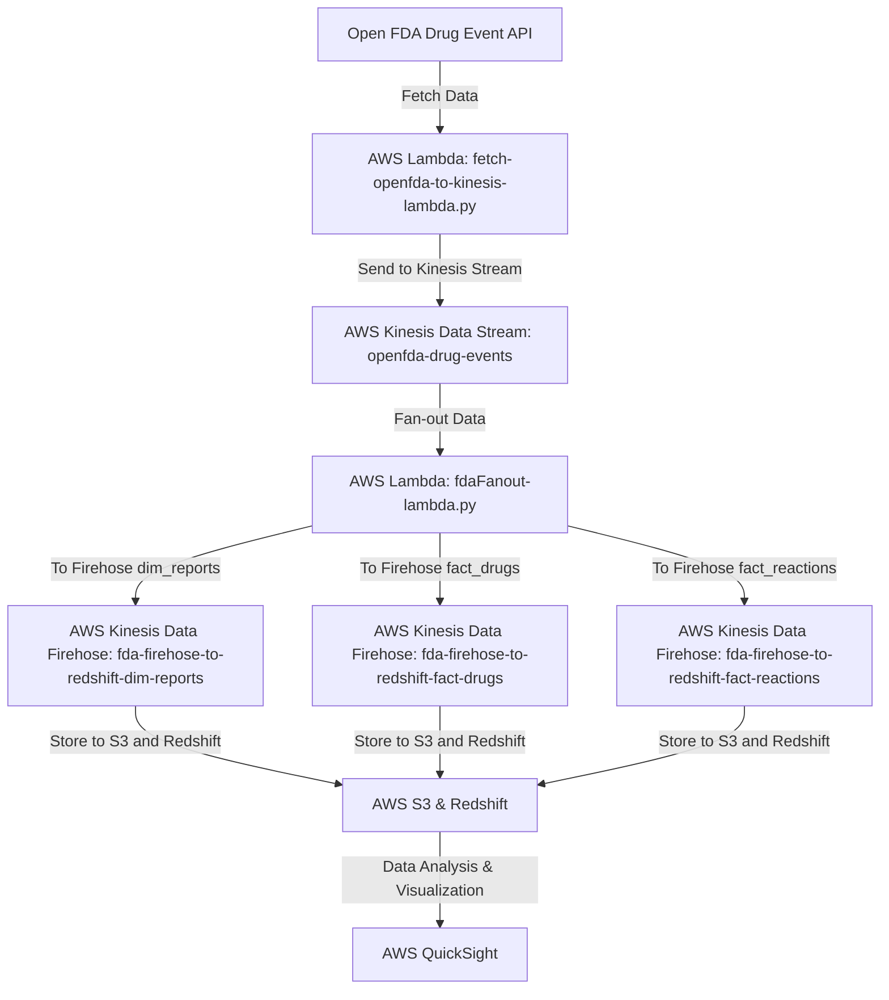
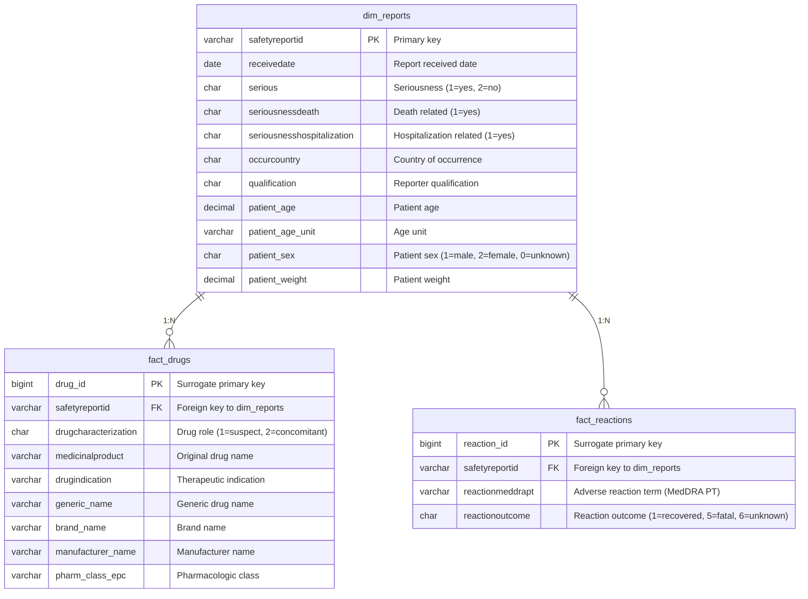
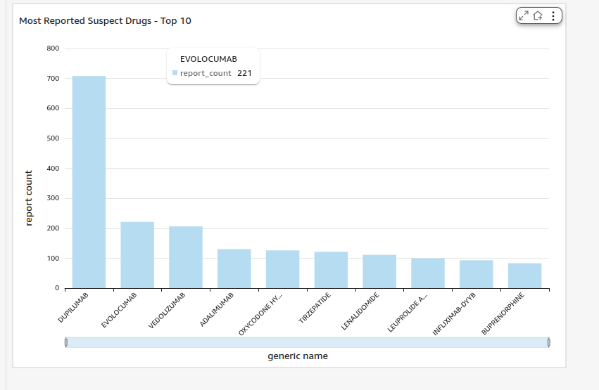
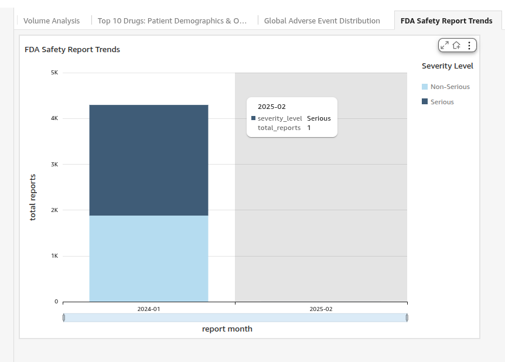

# Real-time Data Streaming ETL for FDA Drug Events

A comprehensive real-time data streaming and ETL (Extract, Transform, Load) system built on AWS platform for processing and analyzing FDA drug event data from the Open FDA API.

## 📋 Table of Contents

- [Project Overview](#project-overview)
- [Architecture](#architecture)
- [Data Flow](#data-flow)
- [Technology Stack](#technology-stack)
- [Database Schema](#database-schema)
- [Installation & Setup](#installation--setup)
- [Configuration](#configuration)
- [Usage](#usage)
- [Visualization](#visualization)

## 🎯 Project Overview

This project is designed to process real-time FDA drug event data from the Open FDA API and transform it into a structured format for analysis and visualization. The system ingests data, processes it through multiple stages, stores it in a data warehouse, and provides insights through visual dashboards.

### Key Features

- **Real-time Data Ingestion**: Continuously fetches drug event data from Open FDA API
- **Stream Processing**: Uses AWS Kinesis for real-time data streaming and processing
- **Data Transformation**: Cleans and transforms raw data into structured format
- **Scalable Storage**: Stores processed data in AWS Redshift for efficient querying
- **Data Visualization**: Provides dashboards using AWS QuickSight
- **Automated Pipeline**: Fully automated ETL pipeline with monitoring

## 🏗️ Architecture

The system follows a microservices architecture with the following components:

```
┌─────────────────┐    ┌─────────────────┐    ┌─────────────────┐
│   Open FDA API   │───▶│  Data Ingestion │───▶│  Kinesis Stream │
│                 │    │   (Lambda)      │    │                 │
└─────────────────┘    └─────────────────┘    └─────────────────┘
                                                        │
                                                        ▼
┌─────────────────┐    ┌─────────────────┐    ┌─────────────────┐
│   Data Analysis │◀───│ Data Processing │───▶│   Data Storage  │
│   (QuickSight)  │    │   (Lambda)      │    │   (Firehose +   │
│                 │    │                 │    │    Redshift)    │
└─────────────────┘    └─────────────────┘    └─────────────────┘
```

### Components

1. **Data Ingestion Layer**
   - AWS Lambda function for fetching data from Open FDA API
   - EventBridge for scheduling ingestion tasks
   - DynamoDB for tracking ingestion state

2. **Stream Processing Layer**
   - AWS Kinesis Data Stream for real-time data streaming
   - Lambda functions for data processing and transformation
   - Kinesis Data Firehose for data delivery

3. **Data Storage Layer**
   - AWS S3 for intermediate data storage
   - AWS Redshift for data warehousing
   - Optimized table schemas for analytical queries

4. **Data Analysis Layer**
   - AWS QuickSight for data visualization
   - SQL queries for data analysis
   - Dashboards for monitoring and insights

## 🔄 Data Flow


### Detailed Flow

1. **Data Collection**: Lambda function fetches data from Open FDA API with pagination support
2. **Stream Ingestion**: Data is sent to Kinesis Data Stream for real-time processing
3. **Data Processing**: Lambda function processes and transforms the data
4. **Data Distribution**: Processed data is fanned-out to three different Firehose streams
5. **Data Storage**: Firehose delivers data to S3 and loads it into Redshift
6. **Data Analysis**: Data is analyzed using SQL queries and visualized in QuickSight

## 🛠️ Technology Stack

| Component | Technology | Purpose |
|-----------|------------|---------|
| **Compute** | AWS Lambda | Serverless functions for data processing |
| **Streaming** | AWS Kinesis Data Streams | Real-time data streaming |
| **Delivery** | AWS Kinesis Data Firehose | Data delivery and transformation |
| **Storage** | AWS S3 | Object storage for intermediate data |
| **Database** | AWS Redshift | Data warehouse for analytics |
| **Orchestration** | AWS EventBridge | Event scheduling and orchestration |
| **State Management** | AWS DynamoDB | Tracking ingestion state |
| **Visualization** | AWS QuickSight | Data visualization and dashboards |
| **Language** | Python 3.x | Lambda function implementation |

## 📊 Database Schema

### Entity Relationship Diagram (ERD)


### Table Schemas

#### dim_reports (Dimension Table)
```sql
CREATE TABLE dim_reports (
    -- Core ID
    safetyreportid VARCHAR(255) NOT NULL PRIMARY KEY, -- Primary key for joins
    
    -- Report metadata
    receivedate DATE,                     -- Report received date
    serious CHAR(1),                      -- Seriousness (1=yes, 2=no)
    seriousnessdeath CHAR(1),             -- Death related (1=yes)
    seriousnesshospitalization CHAR(1),   -- Hospitalization related (1=yes)
    occurcountry CHAR(2),                 -- Country of occurrence (e.g., ES, US)
    qualification CHAR(2),                -- Reporter qualification (1=Physician, 3=Pharmacist, 5=Consumer)

    -- Patient information
    patient_age DECIMAL(8, 2),            -- Patient age (parsed from "patientonsetage")
    patient_age_unit VARCHAR(10),         -- Age unit (801=years, 802=months, etc.)
    patient_sex CHAR(1),                  -- Patient sex (1=male, 2=female, 0=unknown)
    patient_weight DECIMAL(10, 2)         -- Patient weight
)
DISTKEY (safetyreportid)     -- Distribute by this key to keep join keys on the same node
SORTKEY (receivedate, occurcountry); -- Sort by date and country for time-series and geographic analysis
```

#### fact_drugs (Fact Table)
```sql
CREATE TABLE fact_drugs (
    drug_id BIGINT IDENTITY(1,1) NOT NULL PRIMARY KEY, -- Surrogate primary key
    safetyreportid VARCHAR(255) NOT NULL,              -- Foreign key referencing dim_reports
    
    -- Core drug information
    drugcharacterization CHAR(1),              -- Drug role (1=suspect, 2=concomitant)
    medicinalproduct VARCHAR(2000),           -- Original drug name
    drugindication VARCHAR(2000),             -- Therapeutic indication
    
    -- Normalized openFDA information (ETL processed)
    -- Note: These fields appear as arrays in JSON; ETL should extract the first element or merge as needed
    generic_name VARCHAR(65535),              -- Generic drug name
    brand_name VARCHAR(65535),                -- Brand name
    manufacturer_name VARCHAR(65535),         -- Manufacturer name
    pharm_class_epc VARCHAR(65535)            -- Pharmacologic class (EPC)
)
DISTKEY (safetyreportid)        -- Use the same distribution key as dim_reports
SORTKEY (drugcharacterization, generic_name, safetyreportid); -- Optimized for filtering by suspect drugs (1) and drug name
```

#### fact_reactions (Fact Table)
```sql
CREATE TABLE fact_reactions (
    reaction_id BIGINT IDENTITY(1,1) NOT NULL PRIMARY KEY, -- Surrogate primary key
    safetyreportid VARCHAR(255) NOT NULL,                  -- Foreign key referencing dim_reports

    -- Core adverse reaction information
    reactionmeddrapt VARCHAR(1000) NOT NULL,  -- Adverse reaction term (MedDRA PT)
    reactionoutcome CHAR(1)                   -- Reaction outcome (1=recovered, 5=fatal, 6=unknown)
    
    -- ,FOREIGN KEY (safetyreportid) REFERENCES dim_reports (safetyreportid)
)
DISTKEY (safetyreportid)     -- Use the same distribution key as dim_reports
SORTKEY (reactionmeddrapt, safetyreportid); -- Optimized for filtering by specific adverse reactions
```

## 🚀 Installation & Setup

### Prerequisites

- AWS account with appropriate permissions
- Python 3.8+ installed locally
- AWS CLI configured with appropriate credentials
- Basic knowledge of AWS services

### Setup Steps

1. **Clone the Repository**
   ```bash
   git clone <repository-url>
   cd Real-time-Data-Streaming-ETL
   ```

2. **Create AWS Resources**
   - Create Kinesis Data Stream named `openfda-drug-events`
   - Create three Kinesis Data Firehose streams:
     - `firehose-fact-drugs`
     - `firehose-fda-reports`
     - `firehose-fact-reactions`
   - Create S3 bucket for intermediate storage
   - Create Redshift cluster
   - Create DynamoDB table for state tracking

3. **Configure Lambda Functions**
   - Deploy `fetch-openfda-to-kinesis-lambda.py` as Lambda function
   - Deploy `fdaFanout-lambda.py` as Lambda function
   - Set appropriate environment variables

4. **Set Up EventBridge Rules**
   - Create EventBridge rule to trigger data ingestion Lambda
   - Configure schedule (e.g., every 15 minutes)

## ⚙️ Configuration

### Environment Variables

#### fetch-openfda-to-kinesis-lambda.py
```bash
KINESIS_STREAM_NAME=openfda-drug-events
FDA_API_URL=https://api.fda.gov/drug/event.json
STATE_TABLE=openfda-state
```

#### fdaFanout-lambda.py
```bash
FIREHOSE_DRUGS_NAME=firehose-fact-drugs
FIREHOSE_REACTIONS_NAME=firehose-fact-reactions
FIREHOSE_REPORTS_NAME=firehose-fda-reports
```

### AWS Resource Configuration

- **Kinesis Stream**: Provisioned for expected throughput
- **Lambda Functions**: Configured with appropriate memory and timeout
- **Redshift Cluster**: Sized based on data volume and query patterns
- **Firehose Streams**: Configured with buffer size and interval

## 💻 Usage

### Data Ingestion

The system automatically ingests data from Open FDA API every 15 minutes (configurable via EventBridge). The ingestion process:

1. Fetches new drug event records from Open FDA API
2. Tracks pagination using DynamoDB state table
3. Sends records to Kinesis Data Stream
4. Handles errors and retries appropriately

### Data Processing

The processing Lambda function:

1. Receives data from Kinesis Stream
2. Parses and transforms the JSON data
3. Routes data to appropriate Firehose streams based on content
4. Handles data validation and error cases

### Data Analysis

Once data is loaded into Redshift, you can run SQL queries:

```sql
-- Example: Get top 10 most reported drugs
SELECT 
    generic_name,
    COUNT(*) as report_count
FROM fact_drugs
WHERE drugcharacterization = '1' -- Suspect drugs
GROUP BY generic_name
ORDER BY report_count DESC
LIMIT 10;

-- Example: Get serious reports by country
SELECT 
    occurcountry,
    COUNT(*) as serious_reports
FROM dim_reports
WHERE serious = '1'
GROUP BY occurcountry
ORDER BY serious_reports DESC;
```

## 📊 API Documentation

### Open FDA API

The system uses the Open FDA Drug Event API endpoint:
- **Base URL**: `https://api.fda.gov/drug/event.json`
- **Parameters**:
  - `search`: Date range filter (e.g., `receivedate:[20240101+TO+20251231]`)
  - `limit`: Number of records per request (default: 100)
  - `skip`: Pagination offset


## 📈 Visualization

The system includes several visualization dashboards in AWS QuickSight: [Dashborad](https://us-east-1.quicksight.aws.amazon.com/sn/account/yadataen/dashboards/7388f59f-ebe9-4b3c-b31b-c9f5c2e1e58d/sheets/7388f59f-ebe9-4b3c-b31b-c9f5c2e1e58d_5bb0bed7-755c-4877-b1bd-1a278f6938ac)

### 1. Volume Analysis

- Total reports count
- Serious reports count
- Death-related reports count

### 2. Top Suspected Drugs

- Top 10 most reported suspect drugs
- Report counts by drug name

### 3. Safety Report Trends

- Reports over time
- Trend analysis and patterns

### 4. Global Distribution

- Geographic distribution of reports
- Country-wise analysis

### 5. Patient Demographics and Outcomes

- Patient demographics breakdown
- Outcome analysis by drug


### Monitoring and Logging

- CloudWatch Logs for Lambda function monitoring
- CloudWatch Metrics for performance tracking
- AWS X-Ray for distributed tracing
